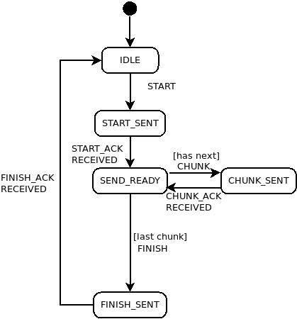

Bluetooth File Transfer
=======================

.. warning::
    The file transfer specification is still work in progress

File transfer to the card10 is implemented using the custom Low Effort File
Transfer Protocol.

BLE Service
-----------
The service consists of two GATT characteristics that act as a bidrectional
link, similar to many BLE UART implementations. The two channels are seen from
the Central perspective and hence named Central TX and Central RX.

The current version uses following service specification:

- Service

  UUID: 42230100-2342-2342-2342-234223422342

- Central TX characteristic:

  UUID: 42230101-2342-2342-2342-234223422342
  write

- Central RX characteristic:

  UUID 42230102-2342-2342-2342-234223422342
  read, notify

Low Effort File Transfer Protocol
---------------------------------
(Version 1)

This protocol was designed to strike a balance between ease of implementation
and reasonable levels of functionality.

Features:

- File push from Central (e.g. Android) to Peripheral (card10)
- Path and file name support
- Chunked data transfer for variable MTUs
- CRC32 error-detection
- Basic error handling

All communication between Central and Peripheral is packet based. The first
byte specifies the packet type using a char followed by an optional CRC and/or
payload, depending on the packet type.

START:

===== ====
  0   1-N
----- ----
  s   path
===== ====

START_ACK:

===== ===
  0   1-4
----- ---
  S   CRC
===== ===

CHUNK:

===== ====== =======
  0     1-4    4-N
----- ------ -------
  c   offset payload
===== ====== =======

CHUNK_ACK:

===== ===
  0   1-4
----- ---
  C   CRC(*)
===== ===

CRC32 of the whole CHUNK packet including first byte, offset and payload.

FINISH:

=== ===
 0
--- ---
 f
=== ===

FINISH_ACK:

=== ===
 0
--- ---
 F
=== ===

ERROR:

=== ===
 0
--- ---
 e
=== ===

ERROR_ACK:

=== ===
 0
--- ---
 E
=== ===

Flow
----

The file transfer process can be described as a series of states from the view
of the Central role:

``IDLE`` state:

    - Send ``START`` to initiate transfer

``START_SENT`` state:

    - Wait for ``START_ACK``

``SEND_READY`` state:

    - Send first ``CHUNK``

``CHUNK_SENT`` state:

    - Wait for ``CHUNK_ACK``

``SEND_READY`` state:

    - Repeat previous two steps until all data is sent
    - If the last chunk was sent, send ``FINISH``

``FINISH_SENT`` state:

    - Wait for ``FINISH_ACK``

After ``FINISH_ACK`` was received, the transfer is complete and the process can
return to ``IDLE``.

Error Handling
--------------
Three types of errors are currently supported:

- CRC errors:

  If an ``ACK`` packet contains a CRC that fails the verification, then the
  original packet must be retransmitted. If three consecutive attempts to
  send a packet fail, then the transfer is aborted.

- ACK timeouts:

  If the Central does not receive a required ``ACK`` within 10 seconds, then
  the original packet must be retransmitted. If three consecutive attempts to
  send a packet fail, then the transfer is aborted.

- Unexpected response:

  All steps in the flow described above have exactly one expected response.
  If any other packet is received, then the transfer is aborted.

Aborting Transfer
-----------------
To abort the transfer, the Central role sends an ``ERROR`` packet and returns
to ``IDLE`` after receiving the ``ERROR_ACK``.
If the Peripheral role aborts the transfer, i.e. the Central receives an
``ERROR`` at any point, then it responds with ``ERROR_ACK`` and returns to
``IDLE``

.. warning::
    As this is a custom file transfer protocol developed under less than ideal
    circumstances, it does not provide any guarantees, especially not regarding
    reliability or security. The protocol assumes a secure link and a
    trustworthy peer, amongst many other things. Use with caution.
