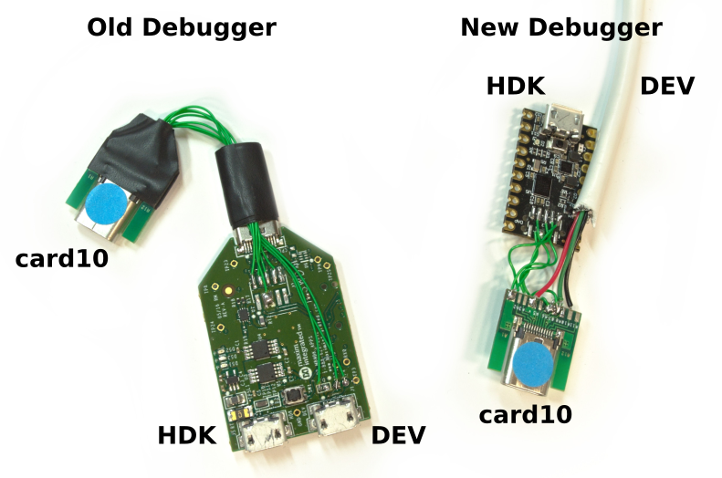

.. _debugger:

Debugger
========
If you have one of our debuggers for card10, this page details how you can use
it.  The debugger looks like either one in the following pictures:

OpenOCD
-------
For debugging card10, you need our `own fork`_ of OpenOCD.  It contains a patch
which allows flashing both flash-banks instead of just one.  Install it using
the following commands:

.. _own fork: https://git.card10.badge.events.ccc.de/card10/openocd

.. code-block:: shell-session

   $ git clone https://git.card10.badge.events.ccc.de/card10/openocd.git
   $ cd openocd

   $ git submodule update --init
   $ ./bootstrap
   $ ./configure --disable-werror
   $ make -j8

Make sure ``CMSIS-DAP Compliant Debugger`` is set to **yes (auto)** after
running ``./configure`` (if it is not, you might need to install libusb).  If
you get errors making the documentation you can ``touch doc/openocd.info`` to
skip it and continue with ``make``.

Please run ``make install`` after removing any already installed OpenOCD
version. Otherwise please always specify the full path to OpenOCD (the binary
is under ``src/openocd``).

GDB (``arm-none-eabi-gdb``)
---------------------------
Apart from OpenOCD you also need ``arm-none-eabi-gdb``.  You should install
that package from your distros repositories:

* Ubuntu: ``gdb-arm-none-eabi``
* Arch: ``arm-none-eabi-gdb``

Debugging
---------
First of all, you need to connect your debugger and card10.  There are three
connections that you need (take a look at the above diagram for more info):

* ``HDK``: This connection provides debugging (SWD) and UART.
* ``DEV``: This connection provides power (battery charger) and the native USB
  connection (bootloader).
* ``USB-C``: Connect the proved USB-C cable with the side which has the blue
  dot, so the blue dots have the same side.

Run OpenOCD from the ``openocd/scripts`` directory in the firmware repository.
Call it as ``openocd -f interface/cmsis-dap.cfg -f target/max32665.cfg``.  If
the debugger and card10 are connected correctly, you should see the following
output:

.. code-block:: shell-session

   $ openocd -f interface/cmsis-dap.cfg -f target/max32665.cfg
   Info : CMSIS-DAP: SWD  Supported
   Info : CMSIS-DAP: FW Version = 1.0
   Info : CMSIS-DAP: Interface Initialised (SWD)
   Info : SWCLK/TCK = 0 SWDIO/TMS = 1 TDI = 0 TDO = 0 nTRST = 0 nRESET = 1
   Info : CMSIS-DAP: Interface ready
   Info : clock speed 2000 kHz
   Info : SWD DPIDR 0x2ba01477
   Info : max32xxx.cpu: hardware has 6 breakpoints, 4 watchpoints
   Info : Listening on port 3333 for gdb connections

Next, start *GDB* in parallel and connect it to OpenOCD.  You can do this easily
if you run GDB from the firmware repository root where we have provided a
``gdbinit`` file. Specify ``-x gdbinit`` to use this file.  Apart from
automatically connecting to OpenOCD, this script file also defines a ``reset``
command to soft-reset card10.

.. code-block:: shell-session

   $ arm-none-eabi-gdb -x gdbinit build/hw-tests/hello-world/hello-world.elf
   ...
   (gdb)

.. warning::
   If you are used to use ``mon reset halt``, be aware that the card10 prototypes
   do not connect the reset line to the debugger. OpenOCD is configured to only do
   a soft-reset. This reset only resets the core, but not its peripherals.
   Our custom ``reset`` sets a special bit in the CPU which also resets the
   peripherals.

You are now connected to card10 and ready to start debugging!  If card10 is
still running, stop it using

.. code-block:: text

   (gdb) mon reset halt

Following that, you can debug as you would normally.
