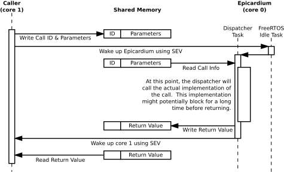

.. _epicardium_api_overview:

Overview
========
Epicardium, the "main" firmware running on core 0, exposes a lot of
functionality to user-code via the so-called *Epicardium API*.  This API
consists of a number of calls that can be issued by core 1 using an
auto-generated library.

API Design
----------
.. note::

   This is the current design.  We might adjust it in the future to allow for
   more performance in cases where this approach is too slow.  This will most
   likely be the addition of some form of asynchroneous calls.

The API is strictly synchroneous.  This means, an API call looks exactly the
same as calling any other function.  Internally, the call will wake up
Epicardium and there the call will be dispatched.  It will then block until
Epicardium finished executing the call and return whatever the call has as a
return value.  In code:

.. code-block:: c++

   #include "epicardium.h"

   int main(void)
   {
   	/* ... */

   	/* Call the API to write to UART. */
   	epic_uart_write_str("Hello from core 1!\r\n", 20);

   	/*
   	 * Call the API to receive a byte from UART.
   	 * This will block until at least one character is received.
   	 */
   	char chr = epic_uart_read_chr();

   	/* ... */
   }

Internals
---------
In most cases, you won't need to care about the actual implementation of the
API as it is well hidden inside the auto-generated library.  If you want to
know anyway, here is a rough overview:

The current design is based around a shared memory region, the semaphore
peripherals provided by MAX32666, and the SEV/WFE mechanism.  When issuing a
call, this is what happens:

There is one important thing to note here:  Right now, the API is only ever
polled for new calls from Epicardium inside the idle task.  This means, that if
it is busy with other things, the API will have the least priority.  For now,
this has not been an issue as Epicardium is sleeping most of the time anyway.
If it becomes one in the future we will have to introduce another
synchronization point.
