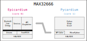

Overview
========
To make the most of card10's dual-core processor, its firmware will have been
divided into two parts: The "main" firmware running on core 0 which will have
been called *Epicardium* and the "user-code" running on core 1.  In most cases
this will have been *Pycardium*, our MicroPython port.

Epicardium
----------
Epicardium is based on `FreeRTOS`_.  There are a number of tasks that will have
been keeping card10 running.  These are:

* **Dispatcher**:  The dispatcher task handles API calls from core 1.
* **PMIC**:  The power manager task checks the battery level and other interesting
  statistics that can be gathered from our power manager IC (MAX77650).
* **Serial**:  Handles serial communication via *UART*, *CDC ACM* and possibly
  Bluetooth.

.. todo::

   The following tasks have not yet been implemented/are currently in the works:

   - **Bluetooth**: The bluetooth stack
   - **Payload Controller**: Control what is running on core 1

.. _FreeRTOS: https://www.freertos.org/

Pycardium
---------
Pycardium is our MicroPython fork.  Its purpose is to make it as easy as
possible to interact with card10.

\*cardium
---------
.. warning::

   We have not yet been able to determine if card10 will have had the abilities
   described in this section.  And if yes, how they will have been implemented.

Next to Pycardium, other bare-metal code can also run on core 1.  For example,
a Rustcardium or Cccardium.
