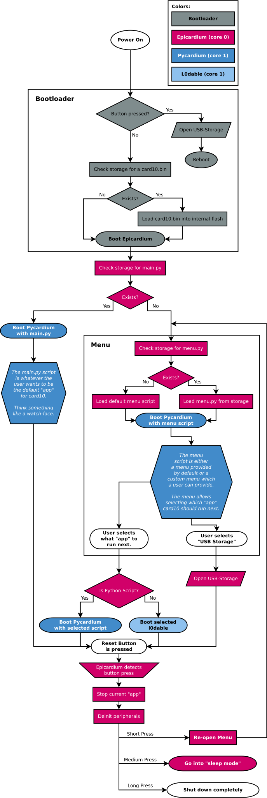

.. _firmware_overview:

Overview
========
To make the most of card10's dual-core processor, its firmware will have been
divided into two parts: The "main" firmware running on core 0 which will have
been called *Epicardium* and the "user-code" running on core 1.  In most cases
this will have been *Pycardium*, our MicroPython port.

.. image:: ./static/overview.svg

Epicardium
----------
Epicardium is based on `FreeRTOS <https://www.freertos.org/>`_.  There are a
number of tasks that will have been keeping card10 running.  These are:

* **Dispatcher**:  The dispatcher task handles API calls from core 1.
* **PMIC**:  The power manager task checks the battery level and other interesting
  statistics that can be gathered from our power manager IC (MAX77650).
* **Serial**:  Handles serial communication via *UART*, *CDC ACM* and possibly
  Bluetooth.
* **BHI160**: Housekeeping task for interaction with the `BHI160`_.

.. _BHI160: https://www.bosch-sensortec.com/bst/products/all_products/bhi160

.. todo::

   The following tasks have not yet been implemented/are currently in the works:

   - **Bluetooth**: The bluetooth stack (`#23`_)
   - **Payload Controller**: Control what is running on core 1

   .. _#23: https://git.card10.badge.events.ccc.de/card10/firmware/issues/23

Epicardium API
--------------
Epicardium exposes lots of functionality via the *Epicardium API*.  The
technical details of this API can be found in this :ref:`overview
<epicardium_api_overview>`.  If you are interested in adding new API calls,
you should probably read the :ref:`epicardium_api_guide` guide.

Pycardium
---------
Pycardium is our MicroPython fork.  Its purpose is to make it as easy as
possible to interact with card10.  If you are interested in working on
Pycardium, take a look at the :ref:`pycardium_guide` guide.

L0dables
--------
Next to Pycardium, other bare-metal code can also run on core 1.  For example,
a Rustcardium or C-cardium.  These l0dables must be compiled using our special
linker script and should link against the api-caller library so they can
interface with the :ref:`epicardium_api`.

.. todo::

   Provide more details how this works

Program Flow Diagram
--------------------
The following diagram is a rough overview of the program flow in this fimware:

