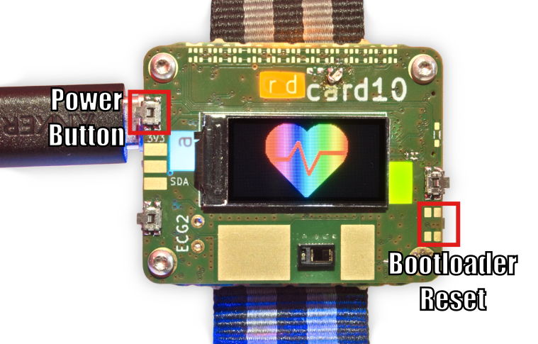

.. _usb_file_transfer:

USB File Transfer
=================

The card10 badge bootloader offers a USB Mass Storage mode to access its 8MB external flash.

This flash contains a FAT32 filesystem and files on it will be visible to software running on the badge.

Getting to the USB mode
-----------------------

To get to the USB mode, you will need to boot the badge while keeping the bottom-right button pressed.

1. If the badge is on, hold the top-left (power) button until the sleep screen appears, then release.
2. Start holding the bottom-right button.
3. Quickly press and release the top-left (power) button to turn the badge on.
4. Your badge should now be in file transfer mode, and you can then release the bottom-right button.

If you succesfully got into USB File Transfer mode, the screen will display its version and notify about the USB mode by displaying ``USB activated. Ready.``. If you connect the badge via USB to your computer, it should now detect 8MB of flash storage that you can mount in the same way as a pendrive.

This pendrive can contain multiple files with different functions, some of them outlined here:

============== ========
File name      Function
============== ========
``card10.bin`` Firmware update file for the badge. If this file is present, the bootloader will perform an internal update to boot from this firmware file, then it will be deleted.
``main.py``    This file contains the default `application` to be run on power on.
``menu.py``    This file contains the default `menu` to be run when the power button is short-pressed.
``*.py``       These are application files written in (Micro)Python that can be run from the menu.
``*.elf``      These are :ref:`l0dables` that can be run from the menu.
============== ========

Updating files and rebooting
----------------------------

No matter which file you are writing, the bootloader will display a red ``Writing`` status message while write operations are pending. Please wait until it displays ``Ready`` again before resetting the badge by pressing the power button again.

